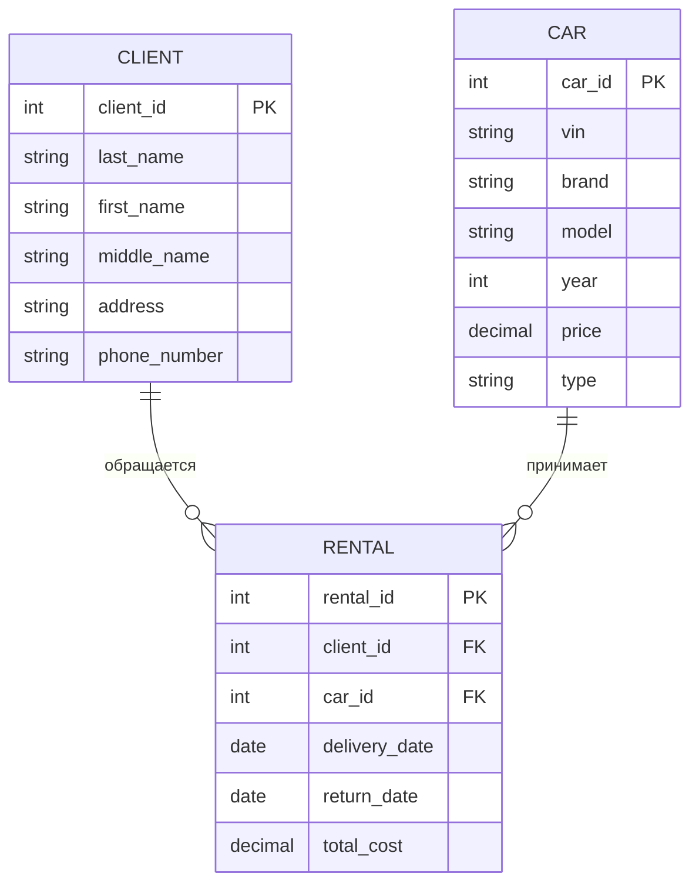
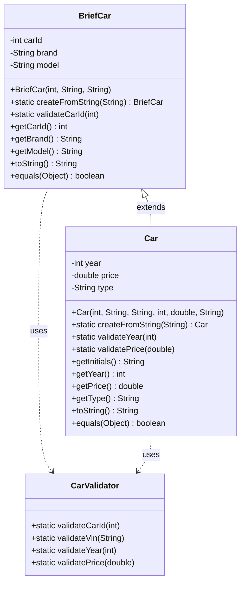

## ER-диаграмма

## Описание таблиц

1. **CLIENT (Клиент)**:
   - client_id: уникальный идентификатор клиента (первичный ключ)
   - last_name, first_name, middle_name: ФИО клиента
   - address: адрес
   - phone_number: номер телефона

2. **CAR (Автомобиль)**:
   - car_id: уникальный идентификатор автомобиля (первичный ключ)
   - vin: серийный номер автомобиля
   - brand: марка автомобиля
   - model: модель автомобиля
   - year: год выпуска автомобиля
   - price: цена автомобиля
   - type: тип автомобиля

3. **RENTAL (Аренда автомобиля)**:
   - rental_id: уникальный идентификатор аренды (первичный ключ)
   - client_id: внешний ключ, связывающий с таблицей CLIENT
   - car_id: внешний ключ, связывающий с таблицей CAR
   - delivery_date: дата выдачи автомобиля
   - return_date: дата возврата автомобиля
   - total_cost: общая стоимость аренды

## Выбранная сущность для дальнейшей работы
**Таблица CAR - Автомобиль**

## Диаграмма классов

